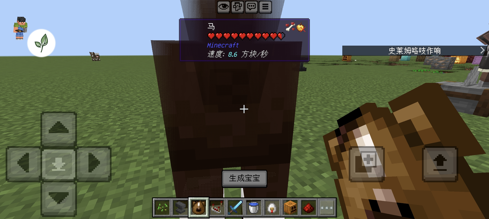
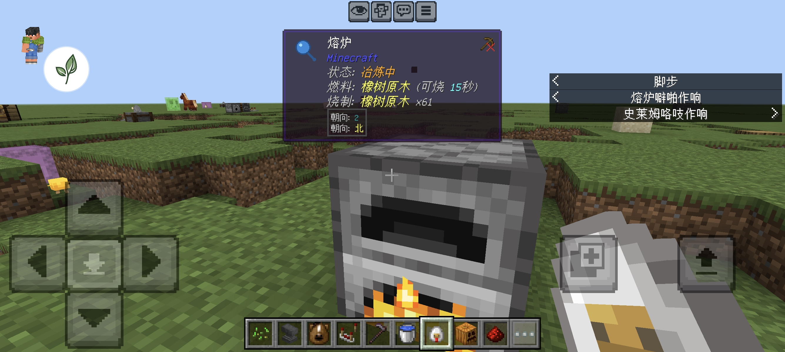
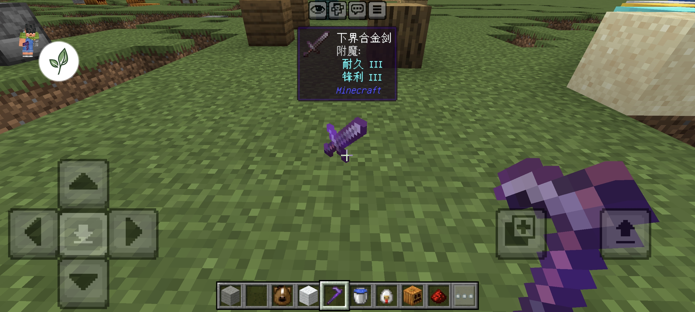

# HoverInfo — 高亮信息显示

一个为 Minecraft 基岩版打造的准星指向信息增强 Add-On。看向方块、生物、掉落物时，屏幕顶部实时显示详细中文信息——支持方块状态、附魔、熔炉燃料、耕地湿度、生物属性等 30+ 项信息，且**完全不触碰玩家背包**。

> 展示名不含任何第三方商标；代码部分基于 MIT 开源项目改进（详见 [LICENSE](LICENSE)）。

---

## ✨ 功能特性

### 🧱 方块信息（蹲下显示详细信息）
- 方块名称（中文，支持本地化 key）
- **方块状态全中文**（朝向/生长/点亮/湿度…100+ 状态名映射）
- 作物生长进度（x/最大 + 状态）
- 耕地湿度（**直接检测 4 格内水源**，非读取不可靠状态值）
- 堆肥桶填充、蜂窝蜂蜜量、炼药锅水量、蜡烛数量与点亮状态
- 红石信号强度、中继器延迟、音符盒音调
- 熔炉/高炉/烟熏炉：**冶炼状态 + 燃料名 + 燃料可烧时长 + 正在烧制的物品**（全部中文）
- 海龟蛋孵化状态、末地传送门框架、重生锚充能
- 方块所需工具提示

### 👤 生物信息
- 生物名称（中文）
- 血条（心形/数值，自适应）
- 幼年 / 已驯服 / 驯服几率 / 坐下 / 充能（苦力怕）/ 已剪毛
- **坐骑奔跑速度**（方块/秒：马/驴/骡/骆驼/猪/炽足兽）
- 僵尸村民**转化中**状态
- 药水效果列表

### 💎 掉落物信息
- 物品名称（中文）+ 数量
- **附魔显示**：内置 40+ 附魔中文映射 + 罗马数字等级，每个附魔独立一行（耐久 I / 锋利 V…）
- 自定义命名物品

### 🖼️ 图标系统
- 900+ 方块/物品**原版平面图标**（16×16，官方 client.jar 提取）
- 生物 3D 模型渲染（不依赖背包）
- Flat（平面）/ 3D（立体）双模式资源子包可切换

### 🛡️ 安全性
- **完全不碰玩家背包**：禁用容器镜像机制（InventoryMirror.apply 为空函数），杜绝物品丢失/错乱
- 日志静默（不刷聊天框）
- 签名去重优化（详细信息变化即时刷新）

---

## 📸 截图

| | |
|---|---|
|  |  |
|  | |

---

## 📦 安装

1. 下载 `高亮信息显示_R4.14.mcaddon`
2. 双击导入 Minecraft（或通过文件管理器打开）
3. 全局资源/行为包中启用
4. 进入世界：**平时**看基础信息，**蹲下（潜行）**看详细信息

> 兼容性：支持基岩版 **1.21 ~ 1.26**（脚本 API），**无需开启实验性玩法**，可直接导入使用。

---

## 🛠️ 技术栈

- **TypeScript** — 全部逻辑
- **@minecraft/server** — 脚本 API（2.x）
- **esbuild** — 打包（bundle + minify）
- 无需 Regolith，纯 npm + esbuild 构建

```
cd packs/data/gametests
npm install
npm i -D esbuild
npx esbuild src/main.ts --bundle --format=esm --target=es2022 --minify \
  --external:@minecraft/server --external:@minecraft/server-ui \
  --outfile=../../BP/scripts/main.js
```

---

## 📁 项目结构

```
packs/
├── BP/                    # 行为包（manifest + scripts/main.js 构建产物）
└── RP/                    # 资源包（UI + 图标纹理 + Flat/3D 子包）
data/gametests/src/
├── main.ts
├── Meta.ts                # 版本信息（构建时生成）
└── waila/core/            # 核心逻辑
│   ├── BlockHandler.ts    # 方块信息（状态/湿度/熔炉/生长）
│   ├── EntityHandler.ts   # 生物信息（幼年/驯服/速度/转化）
│   ├── InventoryMirror.ts # 容器镜像（已禁用，不碰背包）
│   └── look/              # 射线检测 + 信息管线
└── waila/ui/UiBuilder.ts  # UI 内容组装
└── waila/utils/
    ├── BlockStateNames.ts # 方块状态中文映射
    └── EnchantNames.ts    # 附魔中文映射
```

---

## 📜 开源许可

本项目基于 MIT 协议开源。代码改进部分源于开源项目 WAILA（作者 r4isen1920，MIT 许可），按 MIT 要求保留原作者版权声明，详见 [LICENSE](LICENSE)。

---

## 🙏 致谢

- 原开源项目作者 r4isen1920（WAILA，MIT）
- Block & Entity Details 的汉化版本提供部分信息展示思路
- Mojang 官方 client.jar（原版纹理）
